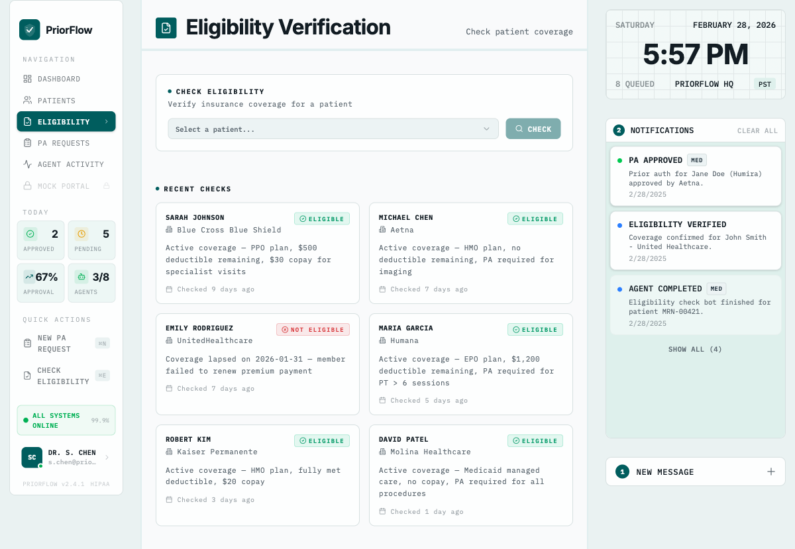

<p align="center">
  
</p>

<h1 align="center">PriorFlow</h1>

<p align="center">
  <strong>AI agents that autonomously navigate real payer portals to complete prior authorizations in minutes, not hours.</strong>
</p>

<p align="center">
  <code>45 min manual process → 3 min fully autonomous</code>
</p>

---

## The Problem

Prior authorizations cost the US healthcare system **~$35 billion per year** in administrative overhead. Each PA request takes a clinician or staff member **45-60 minutes** of manual work — logging into payer portals, filling out forms, writing clinical justifications, and following up on status. That's the equivalent of **100,000+ full-time nurses** worth of labor diverted away from patient care.

## What PriorFlow Does

PriorFlow deploys three AI-powered browser agents that work in sequence to handle the entire PA lifecycle end-to-end:

### Agent 1: Eligibility Checker
Navigates **Stedi** and **Claim.MD** to verify patient insurance coverage and determine whether a prior authorization is required before any work begins.

### Agent 2: PA Form Filler (Core Feature)
The star of the show. This agent logs into **CoverMyMeds** — the industry-standard PA platform used by **950,000+ providers** nationwide — and autonomously:
- Initiates a new PA request with patient demographics and insurance details
- Selects the correct PA form from the payer's form library
- Fills every required field using structured patient chart data
- **Generates clinical justification narratives** from prior therapies, lab results, and imaging findings
- Handles **2FA authentication** (email-based OTP)
- Submits the completed PA electronically to the payer

### Agent 3: Status Monitor
Periodically polls payer portals for determination updates and sends **email alerts** when a PA is approved, denied, or has been pending too long.

## Why It's Awesome

- **Real portals, not mocks.** PriorFlow drives actual CoverMyMeds, Stedi, and Claim.MD — the same platforms healthcare staff use every day.
- **LLM-powered browser automation.** Agents see forms visually and make intelligent clinical decisions using Browser Use SDK + Claude.
- **Clinical narrative generation.** The AI writes medically coherent necessity justifications from structured chart data — prior therapies, lab values, imaging findings.
- **Real-time dashboard.** A 5-stage PA pipeline visualization with live updates powered by Convex, showing every request flowing from Intake → Eligibility → AI Drafting → Submitted → Decision.
- **Full autonomy.** Login, 2FA, form selection, filling, clinical writing, and submission — all without human intervention.

## Demo

<p align="center">
  
</p>

## Architecture

```
Frontend (Next.js + Convex)  →  FastAPI Server  →  Browser Use Agents  →  Real Payer Portals
         │                            │                     │
    Real-time                  Dispatches agents       Stedi, Claim.MD,
    subscriptions              as async tasks           CoverMyMeds
```

## Tech Stack

| Layer | Technology |
|---|---|
| Browser Automation | [Browser Use SDK](https://github.com/browser-use/browser-use) |
| LLM | Claude (Anthropic) |
| Backend | FastAPI + Python 3.12 |
| Real-time Database | Convex |
| Frontend | Next.js + React + Tailwind |
| Notifications | Agentmail |
| Observability | Laminar |
| Memory | Supermemory |

## Quick Start

```bash
# Backend setup
uv venv --python 3.12
uv pip install -e ".[dev]"
cp .env.example .env  # Fill in credentials

# Run tests
uv run pytest

# Start backend
uv run uvicorn server.main:app --reload --port 8000

# Start frontend
cd frontend && npm run dev

# Run agents standalone
uv run python scripts/run_eligibility.py MRN-00421
uv run python scripts/run_pa.py MRN-00421
uv run python scripts/run_full_flow.py MRN-00421
```
